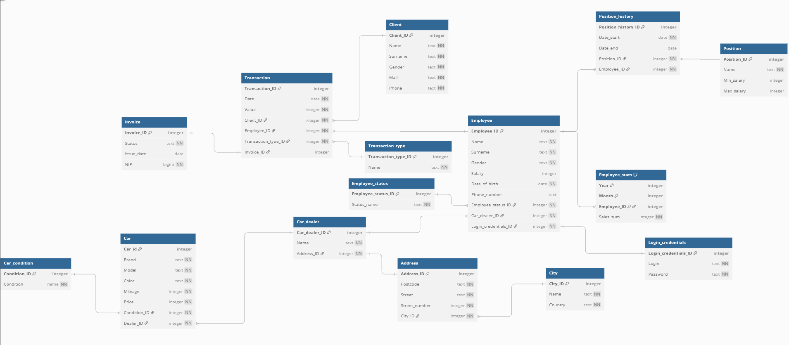

# Dokumentacja Bazy Danych – Salon Samochodowy

<!-- jeszcze trzeba dodać trochę dokumentacji z bazy i frontu -->

## Autorzy
- Jakub Bagiński
- Michał Bloch
- Bartosz Mączka
- Aleksander Paliwoda
- Marta Piraszewska

## 1. Opis ogólny

Baza danych służy do zarządzania działalnością handlową salonów samochodowych. System przechowuje informacje o samochodach, klientach, pracownikach, transakcjach sprzedaży, fakturach, historii zatrudnienia i dealerach. Struktura umożliwia pełną kontrolę nad operacjami biznesowymi i raportowaniem.

---

## 2. Tabele

### Model Relacyjny

### Car

| Kolumna      | Typ     | Ograniczenia   | Opis                    |
| ------------ | ------- | -------------- | ----------------------- |
| Car_id       | integer | PRIMARY KEY    | Identyfikator samochodu |
| Brand        | text    | NOT NULL       | Marka samochodu         |
| Model        | text    | NOT NULL       | Model samochodu         |
| Color        | text    | NOT NULL       | Kolor                   |
| Mileage      | integer | NOT NULL       | Przebieg                |
| Price        | integer | NOT NULL       | Cena                    |
| Condition_ID | integer | NOT NULL, FK   | Stan techniczny         |
| Dealer_ID    | integer | NOT NULL, FK   | Dealer oferujący pojazd |

**Uzasadnienie:** Tabela przechowuje szczegółowe dane dotyczące samochodów oferowanych przez salony. Umożliwia filtrowanie pojazdów po marce, przebiegu, cenie czy stanie.

---

### Car_condition

| Kolumna      | Typ     | Ograniczenia   | Opis                           |
| ------------ | ------- | -------------- | ------------------------------ |
| Condition_ID | integer | PRIMARY KEY    | Id stanu                       |
| Condition    | name    | NOT NULL       | Opis stanu (np. Nowy, Używany) |

**Uzasadnienie:** Umożliwia standaryzację opisu stanu technicznego pojazdów i ogranicza błędy przy wprowadzaniu danych.

---

### Car_dealer

| Kolumna       | Typ     | Ograniczenia   | Opis          |
| ------------- | ------- | -------------- | ------------- |
| Car_dealer_ID | integer | PRIMARY KEY    | Id dealera    |
| Name          | text    | NOT NULL       | Nazwa dealera |
| Address_ID    | integer | NOT NULL, FK   | Adres dealera |

**Uzasadnienie:** Reprezentuje salony samochodowe współpracujące z systemem. Pozwala grupować pracowników i samochody według lokalizacji.

---

### Address

| Kolumna       | Typ     | Ograniczenia   | Opis         |
| ------------- | ------- | -------------- | ------------ |
| Address_ID    | integer | PRIMARY KEY    | Id adresu    |
| Postcode      | text    | NOT NULL       | Kod pocztowy |
| Street        | text    | NOT NULL       | Ulica        |
| Street_number | integer | NOT NULL       | Numer        |
| City_ID       | integer | NOT NULL, FK   | Id miasta    |

**Uzasadnienie:** Przechowuje dane adresowe związane z dealerami. Umożliwia lokalizację salonów.

---

### City

| Kolumna  | Typ     | Ograniczenia   | Opis         |
| -------- | ------- | -------------- | ------------ |
| City_ID  | integer | PRIMARY KEY    | Id miasta    |
| Name     | text    | NOT NULL       | Nazwa miasta |
| Country  | text    | NOT NULL       | Kraj         |

**Uzasadnienie:** Uporządkowane przechowywanie informacji geograficznych. Pozwala łatwo analizować dane wg lokalizacji.

---

### Client

| Kolumna   | Typ     | Ograniczenia   | Opis       |
| --------- | ------- | -------------- | ---------- |
| Client_ID | integer | PRIMARY KEY    | Id klienta |
| Name      | text    | NOT NULL       | Imię       |
| Surname   | text    | NOT NULL       | Nazwisko   |
| Gender    | text    | NOT NULL       | Płeć       |
| Mail      | text    | NOT NULL       | Email      |
| Phone     | text    | NOT NULL       | Telefon    |

**Uzasadnienie:** Rejestruje klientów kupujących samochody. Służy do obsługi relacji handlowych i dokumentów.

---

### Transaction

| Kolumna             | Typ     | Ograniczenia   | Opis          |
| ------------------- | ------- | -------------- | ------------- |
| Transaction_ID      | integer | PRIMARY KEY    | Id transakcji |
| Date                | date    | NOT NULL       | Data          |
| Value               | integer | NOT NULL       | Wartość       |
| Client_ID           | integer | NOT NULL, FK   | Klient        |
| Employee_ID         | integer | NOT NULL, FK   | Pracownik     |
| Transaction_type_ID | integer | NOT NULL, FK   | Typ           |
| Invoice_ID          | integer | UNIQUE         | Faktura       |

**Uzasadnienie:** Rejestruje wszystkie sprzedaże samochodów. Umożliwia raportowanie wyników i analizę historii zakupów.

---

### Employee

| Kolumna              | Typ     | Ograniczenia   | Opis           |
| -------------------- | ------- | -------------- | -------------- |
| Employee_ID          | integer | PRIMARY KEY    | Id             |
| Name                 | text    | NOT NULL       | Imię           |
| Surname              | text    | NOT NULL       | Nazwisko       |
| Gender               | text    | NOT NULL       | Płeć           |
| Salary               | integer |                | Pensja         |
| Date_of_birth        | date    | NOT NULL       | Data urodzenia |
| Phone_number         | text    |                | Telefon        |
| Employee_status_ID   | integer | NOT NULL, FK   | Status         |
| Car_dealer_ID        | integer | NOT NULL, FK   | Dealer         |
| Login_credentials_ID | integer | NOT NULL, FK   | Dane logowania |

**Uzasadnienie:** Przechowuje dane pracowników zatrudnionych w salonach. Umożliwia przypisanie ich do transakcji i śledzenie historii zatrudnienia.

---

### Employee_status

| Kolumna            | Typ     | Ograniczenia   | Opis          |
| ------------------ | ------- | -------------- | ------------- |
| Employee_status_ID | integer | PRIMARY KEY    | Id            |
| Status_name        | text    | NOT NULL       | Nazwa statusu |

**Uzasadnienie:** Pozwala kontrolować zatrudnienie (np. aktywny, urlop, zwolniony).

---

### Position

| Kolumna     | Typ     | Ograniczenia   | Opis              |
| ----------- | ------- | -------------- | ----------------- |
| Position_ID | integer | PRIMARY KEY    | Id                |
| Name        | text    | NOT NULL       | Nazwa             |
| Min_salary  | integer |                | Minimalna pensja  |
| Max_salary  | integer |                | Maksymalna pensja |

**Uzasadnienie:** Umożliwia kontrolowanie hierarchii i przedziałów płacowych w firmie.

---

### Position_history

| Kolumna             | Typ     | Ograniczenia   | Opis       |
| ------------------- | ------- | -------------- | ---------- |
| Position_history_ID | integer | PRIMARY KEY    | Id         |
| Date_start          | date    | NOT NULL       | Początek   |
| Date_end            | date    |                | Koniec     |
| Position_ID         | integer | NOT NULL, FK   | Stanowisko |
| Employee_ID         | integer | NOT NULL, FK   | Pracownik  |

**Uzasadnienie:** Pozwala śledzić historię stanowisk danego pracownika, co wspiera oceny i awanse.

---

### Invoice

| Kolumna    | Typ     | Ograniczenia   | Opis             |
| ---------- | ------- | -------------- | ---------------- |
| Invoice_ID | integer | PRIMARY KEY    | Id               |
| Status     | text    | NOT NULL       | Status           |
| Issue_date | date    |                | Data wystawienia |
| NIP        | bigint  | NOT NULL       | Numer podatkowy  |

**Uzasadnienie:** Zawiera dane faktur dla transakcji. Kluczowe przy rozliczeniach i raportowaniu.

---

### Transaction_type

| Kolumna             | Typ     | Ograniczenia   | Opis                        |
| ------------------- | ------- | -------------- | --------------------------- |
| Transaction_type_ID | integer | PRIMARY KEY    | Id                          |
| Name                | text    | NOT NULL       | Typ (np. sprzedaż, leasing) |

**Uzasadnienie:** Umożliwia klasyfikowanie transakcji według ich charakteru.

---

### Employee_stats

| Kolumna     | Typ     | Ograniczenia   | Opis           |
| ----------- | ------- | -------------- | -------------- |
| Year        | integer | PK (cz.1)      | Rok            |
| Month       | integer | PK (cz.2)      | Miesiąc        |
| Employee_ID | integer | PK (cz.3), FK  | Pracownik      |
| Sales_sum   | integer | NOT NULL       | Suma sprzedaży |

**Uzasadnienie:** Gromadzi dane do statystyk i raportów miesięcznych pracowników.

---

### Login_credentials

| Kolumna              | Typ     | Ograniczenia   | Opis   |
| -------------------- | ------- | -------------- | ------ |
| Login_credentials_ID | integer | PRIMARY KEY    | Id     |
| Login                | text    | NOT NULL       | Login  |
| Password             | text    | NOT NULL       | Hasło  |

**Uzasadnienie:** Przechowuje dane potrzebne do logowania pracowników do systemu.

---

## 3. Relacje

- Car → Car_condition, Car → Car_dealer
- Car_dealer → Address, Address → City
- Transaction → Client, Transaction → Employee, Transaction → Transaction_type, Transaction → Invoice
- Employee → Employee_status, Employee → Car_dealer, Employee → Login_credentials
- Position_history → Employee, Position_history → Position
- Employee_stats → Employee

---

## 4. Zastosowanie

System może być używany przez sieć salonów samochodowych do zarządzania ofertą, personelem, klientami i wynikami sprzedaży. Dane są przygotowane do rozbudowanej analityki, raportów oraz obsługi procesów biznesowych.